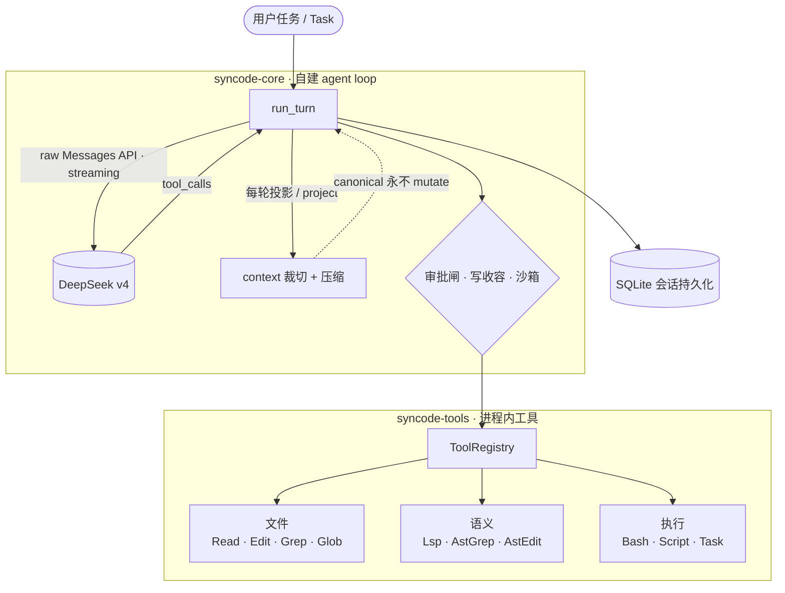

<div align="center">

# SynCode

**纯 Rust 的自建 AI 编程 agent** · *A self-built AI coding agent in pure Rust*

DeepSeek v4 · 自建 agent loop(无 SDK)· 完全掌控 context 裁切
<br/>
*Raw Messages API · self-built agent loop · total control over context*

<br/>

[](LICENSE)
[](rust-toolchain.toml)
[](#平台--platforms)
[](https://api.deepseek.com)
[](#状态与路线图--status--roadmap)

</div>

---

## 这是什么 / What is SynCode

SynCode 是一个**纯 Rust、单二进制**的 AI coding agent。它刻意区别于 shell-out / TypeScript 系的 agent:核心赌注是 **DeepSeek v4(OpenAI 兼容口)+ 在 raw Messages API 上自建 agent loop(不依赖任何 Agent SDK)**,以换取对 **context 的完全掌控**——可以对 `messages`、tool-results、CoT 做任意裁切(删整轮、把工具结果置存根、把 `reasoning_content` 置空回收 token)。

差异化不来自速度,而来自 Rust 的 **in-process** 能力:把工具从「对文件字节操作」抬升到「对程序的**活语义模型**操作」(LSP / tree-sitter AST / file-watch),并以一套**可回溯的沙箱底座**让「激进授权」变得安全。

> SynCode is a pure-Rust, single-binary coding agent built on the **raw** DeepSeek Messages API — **no Agent SDK** — so it owns every byte of context trimming. Its edge isn't speed; it's running tools **in-process** against a program's live semantic model, behind a tightenable sandbox.

## ✨ 四大支柱 / Four Pillars

| | 支柱 / Pillar | 含义 / What it means |
|:--:|---|---|
| 🧠 | **掌控 context** · *Own the context* | 自主、结构化地裁切并智能压缩 `messages` / tool-results / CoT。压缩**质量**是真正的上限杠杆,优先于工具速度。 |
| 🤖 | **高自治执行** · *Aggressive autonomy* | 敢把大幅自治权交给模型与子 agent——**前提**是安全底座(支柱 4)先到位。 |
| 🔬 | **进程内语义操作** · *In-process semantics* | 工具跑在 agent 自己的进程内,直接操作 LSP / AST 的活语义模型,而非裸字节;code-as-action 走嵌入式 rhai VM。 |
| 🛡️ | **可回溯沙箱** · *Revertible sandbox* | cap-std 能力式 FS + Seatbelt / landlock+seccomp / Job Objects + 审批闸。原则:**能安全收紧,才敢激进授权**。 |

## 🏗️ 架构 / Architecture



**一个 turn 的生命周期**:`Session`(canonical 日志)→ `AgentLoop::run_turn` 每轮把日志**投影**成裁切后的 wire 请求(canonical 永不被改写)→ DeepSeek 流式返回 → 解析 `tool_calls` → 经审批闸 / 写收容 / 沙箱后派发给工具 → 结果回灌 → 直到模型不再请求工具。Context 超水位时自动滚动窗口 + LLM 摘要压缩。

## 📦 工作区 / Workspace

纯 Rust Cargo workspace,按关注点拆分为 8 个 crate:

| crate | 职责 / Responsibility |
|---|---|
| **`syncode-core`** | 自建 agent loop · 会话与持久化 · context 裁切/压缩 · 工具 registry · 审批闸 · cap-std 写收容 |
| **`syncode-llm`** | DeepSeek 类型化 client:自有 wire 类型 · 流式重组 · 确定性退避重试 · context 裁切原语 |
| **`syncode-tools`** | 13 个进程内工具(见下表) |
| **`syncode-ast`** | tree-sitter + ast-grep 驱动的结构化搜索 / 改写 / 语法合法性校验 |
| **`syncode-lsp`** | 进程内 LSP 客户端:常驻语言服务器 + 手写 JSON-RPC,取**真**语义事实 |
| **`syncode-sandbox`** | 安全底座:Seatbelt(macOS)· landlock+seccomp(Linux)· Job Object(Windows)· cap-std 能力式 FS |
| **`syncode-ui`** | **桌面应用(gpui)— SynCode 唯一面向用户的界面**(独立 sub-workspace,驱动**真**的 agent loop) |
| **`syncode-cli`** | headless 开发 / 评测 harness(驱动 `run_turn` 跑真 DeepSeek)——**非发布接口**,仅供开发 / 测试 |

### 🧰 工具套件 / Tool suite

| 类别 | 工具 | 说明 |
|---|---|---|
| 文件 | `Read` `Write` `Edit` | read-before-write 契约 · 原子写 · 写给模型读的 error message |
| 搜索 | `Glob` `Grep` | 进程内 gitignore-aware 遍历(`ignore` crate) |
| 语义 | `AstGrep` `AstEdit` `Lsp` | 结构化搜改 + 语法校验 · 跳转/引用/悬停/诊断 |
| 执行 | `Bash` `BashOutput` `Script` `Task` `TodoWrite` | 沙箱化 shell(kill-tree · env 擦除)· 后台输出 · rhai code-as-action · 子 agent · 计划外化 |

## 🚀 快速开始 / Quickstart

**前置 / Prerequisites** — Rust stable(`rustc 1.85+`,edition 2024;见 `rust-toolchain.toml`)+ 一个 DeepSeek API key。

SynCode 的界面是 **gpui 桌面应用**(`syncode-ui`)。启动它:

```sh
export DEEPSEEK_API_KEY="sk-..."        # 注入 API key(切勿硬编码)
cd crates/syncode-ui && cargo run       # 启动桌面应用(唯一面向用户的界面)
```

> `syncode-ui` 是独立 sub-workspace(隔离 gpui 的庞大依赖树),首次构建较慢。它驱动**真**的 agent loop:
> 流式输出、工具/推理折叠卡、交互式审批、Stop 取消、按 workspace 持久化 resume。

**Headless harness(开发 / 评测用,非发布接口)/ Dev harness** — 不想构建 gpui 时,用 `syncode-cli` 直接对 DeepSeek 跑一个真的 `run_turn`(单 turn、内部多轮 tool-call),用来验证 agent loop / 工具 / 压缩:

```sh
cargo run -p syncode-cli -- "你的任务…"        # 跑指定任务
cargo run -p syncode-cli                       # 跑一个内置 demo 任务
cargo run -p syncode-cli -- --no-sandbox "…"   # 关掉 OS 沙箱(逃生口,默认开)
```

## ⚙️ 配置 / Configuration

| 项 | 值 |
|---|---|
| 环境变量 / Env | `DEEPSEEK_API_KEY`(必需) |
| 模型 / Model | `deepseek-v4-pro` |
| 入口 / Endpoint | `https://api.deepseek.com`(OpenAI 兼容) |
| Harness 参数 | `syncode-cli --no-sandbox` 关闭 OS 沙箱;其余 argv 拼成任务(仅 harness) |

审批器 / 写收容 / 工具 cwd 全部由**同一个** `project_root`(默认当前工作目录)驱动,保证授权范围与收容范围不会漂移。

## 🛡️ 安全与沙箱状态 / Security & sandbox status

SynCode 默认**开启** OS 沙箱,并坚持「能安全收紧才敢放权」。当前诚实的边界:

- ✅ **写收容**:所有进程内写(Write/Edit/AstEdit)都经 cap-std `Dir` 句柄收容到工作区,堵住 symlink TOCTOU;macOS Seatbelt 把 Bash 子进程的写也限制在工作区 + 构建缓存。
- ✅ **fail-closed**:沙箱加载失败 = 命令拒跑;审批闸无交互通道时默认拒绝;命令分类器对未知命令一律升级为 Ask。
- ⚠️ **进行中**:macOS 暂未在内核层拦截**网络**(命令分类器是 UX 启发式,**不是**安全边界);Linux 的 landlock+seccomp 已实现但**尚未接入** live 执行路径;Windows Job Object 在容器层已就位,完整对齐进行中。

> 因此当前请把沙箱视为**纵深防御**而非硬边界,尤其在 Linux 上、或处理不可信输入时保持谨慎。收紧网络与接入 Linux 后端是首要路线项。

## 📍 状态与路线图 / Status & Roadmap

> **状态:积极开发中(early but real)。** 已是一个可运行的自建 agent——**不是**脚手架。
> ~12k 行 Rust · 156 个测试全绿 · `cargo build --workspace` 零警告 · 0 个 `todo!()`。

**今天能用 / Works today**

- 自建 agent loop:raw DeepSeek Messages API,流式、确定性重试、`tool_calls` 派发、子 agent(深度 1)
- context 压缩:滚动 N-turn 窗口 · 工具结果存根 · CoT 回收 · LLM 摘要兜底(确定性、保护 prompt cache 前缀)
- 13 个进程内工具 + 进程内 LSP / tree-sitter 语义层
- 审批闸 + cap-std 写收容 + macOS Seatbelt 写沙箱(默认开)
- **桌面应用(gpui)= 唯一界面**:流式输出 · 交互式审批 · Stop 取消修复 · 按 workspace 的 SQLite 持久化 / resume

**路线图 / Roadmap**

- 内核级网络收紧;把 Linux landlock+seccomp 接入 live 路径
- 特权 broker + overlayfs COW 一次性可丢弃实验沙箱
- below-shell:把热批量编为 native、不可信计算编为 WASM 跑在 wasmtime 上
- CI(build/test/fmt/clippy + 各平台沙箱回归);`Read` 默认窗口等鲁棒性补强
- 移动端瘦客户端(驱动远程 agent)

## 🤝 贡献 / Contributing

欢迎 issue 与 PR。提交前请确保:

```sh
cargo build --workspace
cargo test  --workspace
cargo fmt --all && cargo clippy --workspace --all-targets
```

## 📄 许可证 / License

以 **AGPL-3.0-only** 开源(强 copyleft + 网络条款:通过网络提供的修改版亦须开源)。完整条款见 [LICENSE](LICENSE)。

<div align="center"><sub>Built in Rust · powered by DeepSeek v4</sub></div>
